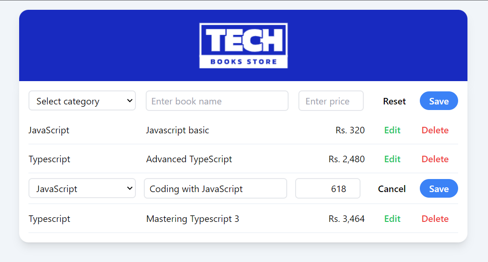

# Multi-container application running with Docker



## Tech Stack

- [MERN](https://www.mongodb.com/mern-stack)
- [Tailwind CSS](https://tailwindcss.com/)
- [Docker](https://www.docker.com/)
  - images
    - [mongo](https://hub.docker.com/_/mongo) _(mongodb)_
    - optional: [mongo-express](https://hub.docker.com/_/mongo-express) _(mongodb web based interface)_

## Prerequisites

- Install [Node](https://nodejs.org/en/download/)
- Install [Docker](https://docs.docker.com/desktop/)

## 1. Running application with `docker compose`

- Run following from root of project

```shell
# It pulls and/or creates images
# Creates network, volume, containers
pnpm dev:build # docker compose up -d

# To recreate containers after making changes to local
pnpm dev:rebuild # docker compose up -d --build
```

#### Start the application

Open http://localhost:3000

#### To view source files and mongodb record in container

```shell
# api
docker exec -it app-docker-api-1 sh
    # then
    ls

# ui
docker exec -it app-docker-ui-1 sh
    # then
    ls usr/share/nginx/html

# mongodb
docker exec -it app-docker-mongo-1 mongosh -u admin -p admin
    # then
    show dbs
    use books
    show collections
    db.tech.find()

# To view mongodb from browser
http://localhost:8081
```

#### Remove created containers, network & volume

- Run following from root of project

```shell
# remove containers
pnpm dev:down # docker compose down --volumes

# to remove app images also
pnpm dev:down:images # docker compose down --volumes --rmi "local"
```

## 2. Running application with `docker run`

> Without Dockerfile and Compose file

#### Create a docker network

```shell
docker network create app-docker-network
```

#### Create a volume to persist mongodb data

```shell
docker volume create app-docker-db-volume
```

#### Start mongo in defined network and use defined volume

```shell
docker run -d \
    --name app-docker-mongo \
    --network app-docker-network \
    -v app-docker-db-volume:/data/db \
    -p 27017:27017 \
    -e MONGO_INITDB_ROOT_USERNAME=admin \
    -e MONGO_INITDB_ROOT_PASSWORD=admin \
    mongo
```

#### Start mongo-express in defined network

```shell
docker run -d \
    --name app-docker-mongo-express \
    --network app-docker-network \
    -p 8081:8081 \
    -e ME_CONFIG_MONGODB_ADMINUSERNAME=admin \
    -e ME_CONFIG_MONGODB_ADMINPASSWORD=admin \
    -e ME_CONFIG_MONGODB_SERVER=app-docker-mongo \
    mongo-express
```

#### To view mongodb

- Open **mongo-express** from browser by http://localhost:8081 to view mongodb as web based interface
- or access to **mongodb** from `mongosh` cli

```shell
docker exec -it app-docker-mongo mongosh -u admin -p admin
```

#### Start the application

```shell
pnpm install -r

cd api
# Create copy of .env.sample and rename it to .env in the same location
pnpm run dev

# UI
cd ui
# Create copy of .env.sample and rename it to .env in the same location
pnpm run dev
```

Open http://localhost:3000

#### Remove created containers, network & volume

```shell
# remove containers
docker rm -f app-docker-mongo app-docker-mongo-express

# remove network
docker network rm app-docker-network

# remove volume
docker volume rm app-docker-db-volume
```
